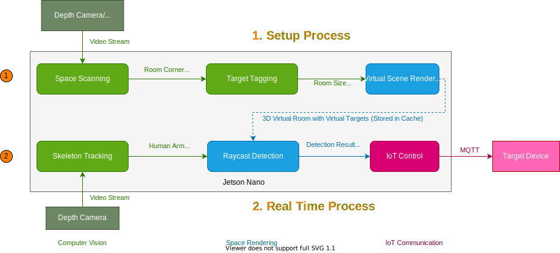

# Home Vision
A skeleton tracking based smart home system (Capstone Project)

System Architecture

 
 

## Run the demo
* Following the [instruction](RaycastDetection/README.md) to run the Unity Project 

## Credits
Tuya Device Related:
* https://github.com/codetheweb/tuyapi
* https://github.com/ClusterM/tuyanet/

