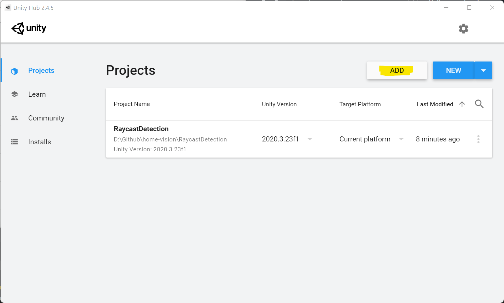
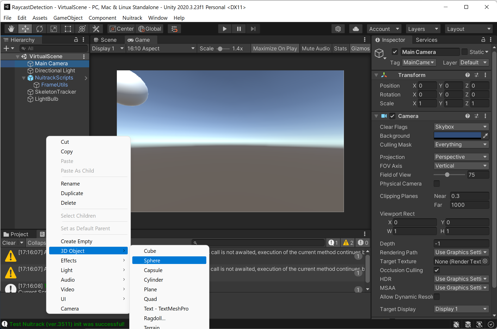

# Instructions for Running this Unity Project

## Requirements:
* [Nuitrack Runtime](/Platforms) and [Nuitrack SDK](https://github.com/3DiVi/nuitrack-sdk)
* Any supported sensor (We are using Intel Realsense L515), see the complete list at [Nuitrack website](https://nuitrack.com/#sensors))
* Unity 2020.3 LTS or higher

## Preparations:
1. Download and install Nuitrack following the [installation instructions](https://github.com/3DiVi/nuitrack-sdk/blob/master/doc/Install.md). 
1. Download Unity [from the official website](https://unity3d.com/get-unity/download) and install 2020.3 LTS Version. Remember to add Windows/Linux/Mac Build Support Modules during the installation (Depends on your system)

## Run the Project:
1. Add the project folder: `RaycastDetection` to your Unity Hub as follows:
  
1. Open the `RaycastDetection` project in Unity Hub.
1. Click on `Play` button.

Vola! You can now see the real-time raycast detection and control the IoT devices.

## Change or add a new IoT target device:
* Just change the only device in the virtual scene:
    1. Retrieving Tuya Plug ID and LocalKey values following the instruction at [codetheweb/tuyapi](https://github.com/codetheweb/tuyapi/blob/master/docs/SETUP.md)
      * Note: For the ip address of your tuya devices, you can use the [TyuaDeviceScanner](../TuyaDeviceScanner) in this repo.
    1. Change the Tuya Plug ID and LocalKey values in the `SkeletonTracker.cs` File as follows:
        ```C#
        // Line 130
        static async Task TurnON()
        {
            var device = new TuyaPlug()
            {
                IP = "YOUR_TUYA_DEVICE_IP",
                LocalKey = "YOUR_TUYA_LOCAL_KEY",
                Id = "YOUR_TUYA_DEVICE_ID"
            };
            var status = await device.GetStatus();
            await device.SetStatus(!status.Powered); // toggle power
        }
        ```
* Add an extra Tuya device in the virtual scene:
    1. Add a new Tuya device in the `VirtualScene` as follows:
    
       You can drag and drop the new Sphere Object in the `VirtualScene` to the desired position.
    1. Add a new code snippet in the `SkeletonTracker.cs` file as follows:
        ```C#
        // Line 65
        RaycastHit hit;
            if (Physics.Raycast(toPosition, Foward, out hit))
            {
                detectMessage = "Active";
                // Targeting specific devices
                if (hit.collider.gameObject.name == "LightBulb")
                {
                    hitCount++;
                    detectMessage = "Hit Ball";
                    deviceRenderer.material.SetColor("_Color", Color.green);
                }
                // -------- like this: ---------
                else if (hit.collider.gameObject.name == "Lamp")
                {
                    hitCount++;
                    detectMessage = "Hit Ceiling";
                    deviceRenderer.material.SetColor("_Color", Color.red);
                }
                // ------------------------------
                else
                {
                    deviceRenderer.material.SetColor("_Color", Color.white);
                }
            }
            
       // line 85
            if (hitCount >= 30)
                {
                    // Call the device control function as you wish
                }
        ```
